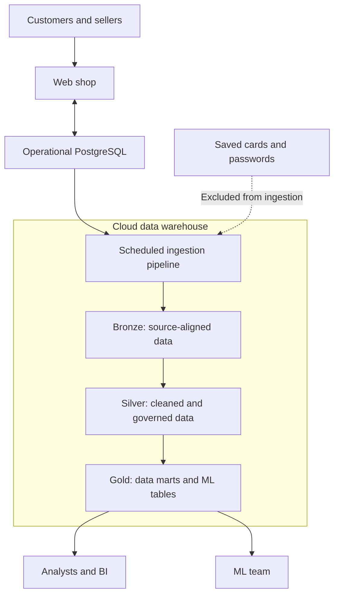

# Architecture

> Update this page at the end of every lesson. It is the diagram you present at
> the oral defence.

## Context

Albert's Marketplace needs to separate analytical workloads from the operational
PostgreSQL database used by the customer-facing website. Analysts need governed
and consistent metrics instead of direct SQL queries and manually processed CSV
exports. The ML team needs reliable daily sales data by product and country.
Sensitive saved-card and password data must never enter the analytical platform.

## Target architecture

Replace this placeholder with your group's diagram. Name each technology once
your group has chosen it, and link the ADR that chose it.

## Layers

| Layer | What lands there | Transformations | Guarantee |
|---|---|---|---|
| Bronze | Source-aligned copies of orders, customers, products and reviews | Minimal validation and ingestion metadata added; passwords and saved-card data excluded | Authorised source data is preserved and traceable |
| Silver | Cleaned orders, customers, products and reviews | Deduplication, type validation, standardised dates and countries, joins and shared revenue rules | One clean and governed version of each business fact |
| Gold | Reporting data marts, dimensions, fact tables and ML-ready datasets | Business aggregations and dimensional modelling | Data is ready for a defined analytical or ML use case |
  
## Decisions

| ADR | Decision | Status |
|---|---|---|
| [0001](adr/0001-target-architecture.md) | Use a cloud data warehouse as the target analytical platform | Accepted |

## Change log

| Lesson | What changed |
- Passwords and saved-card data are excluded before ingestion.
- Access is granted according to user roles.
- Business definitions, including revenue, are implemented once in Silver.
| L01 | First version |
