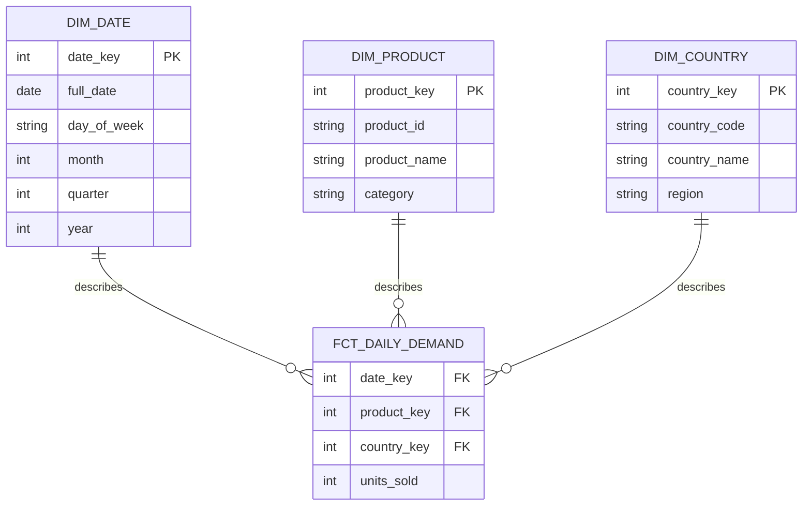

## Business process

The business process being measured is daily product sales and demand across
countries.

## Grain

One row in `fct_daily_demand` represents the total units sold for one product,
in one delivery country, on one calendar day.

## Dimensions

### `dim_product`

| Column | Description |
|---|---|
| `product_key` | Warehouse surrogate key |
| `product_id` | Product identifier from the source system |
| `product_name` | Product name |
| `category` | Product category |

### `dim_country`

| Column | Description |
|---|---|
| `country_key` | Warehouse surrogate key |
| `country_code` | ISO country code |
| `country_name` | Country name |
| `region` | Geographical region |

### `dim_date`

| Column | Description |
|---|---|
| `date_key` | Date key in `YYYYMMDD` format |
| `full_date` | Calendar date |
| `day_of_week` | Day of the week |
| `month` | Calendar month |
| `quarter` | Calendar quarter |
| `year` | Calendar year |

## Facts

### `fct_daily_demand`

| Column | Type | Description |
|---|---|---|
| `date_key` | Foreign key | References `dim_date` |
| `product_key` | Foreign key | References `dim_product` |
| `country_key` | Foreign key | References `dim_country` |
| `units_sold` | Additive fact | Total quantity of units sold |

## Schema

